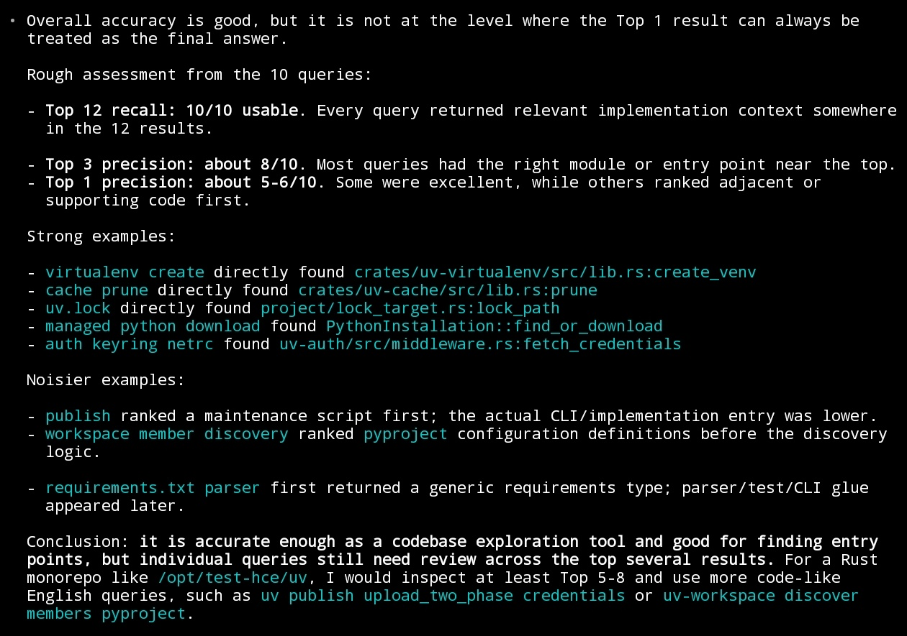
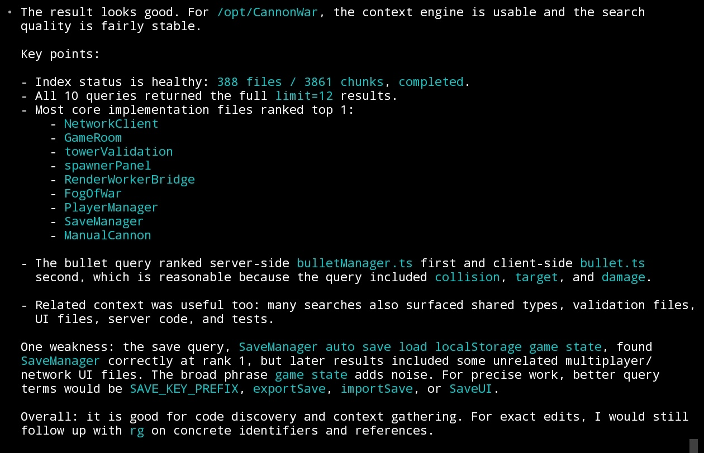
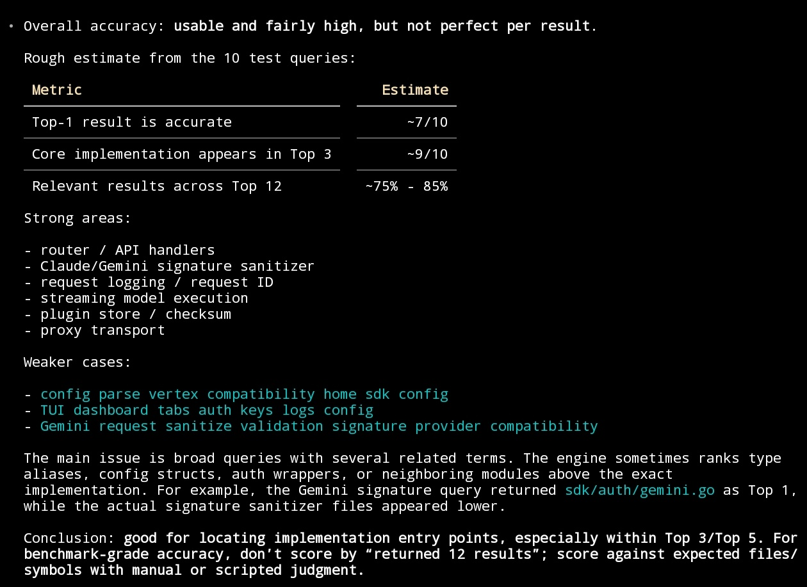

# Hitmux Context Engine

Language: English | [中文](README.zh-CN.md) | [Español](README.es.md) | [Français](README.fr.md) | [Deutsch](README.de.md) | [日本語](README.ja.md) | [한국어](README.ko.md)

Semantic code search for MCP clients.

Hitmux Context Engine indexes a repository into Milvus-compatible vector storage, then gives Claude Code, OpenAI Codex CLI, OpenCode, Cursor, Windsurf, and other MCP clients focused tools for finding code by behavior, symbol, workflow, or file role.

[](https://nodejs.org/)
[](https://www.npmjs.com/package/@hitmux/hitmux-context-engine-core)
[](https://www.npmjs.com/package/@hitmux/hitmux-context-engine-mcp)
[](LICENSE)

Use it when an AI coding agent needs more than text grep:

- Search indexed code with natural-language or identifier-heavy queries.
- Prefer implementation files while still surfacing related tests, docs, config, and exports when useful.
- Keep project configuration in simple `config.conf` files instead of per-client environment setup.

Typical first-use workflow:

```text
hce index .
Check the indexing status
Find the handler that validates MCP tool arguments
```

## Quick Start

Create or complete the runtime config:

```bash
npm install -g @hitmux/hce@latest
hce init
```

Then edit `~/.hitmux-context-engine/config.conf` and fill in the provider key. Check local config and connectivity:

```bash
hce doctor
```

For Claude Code, add the MCP server:

```bash
claude mcp add hitmux-context-engine -- hce
```

For OpenAI Codex CLI, add the MCP server:

```bash
codex mcp add hitmux-context-engine -- hce
```

The full package alias `@hitmux/hitmux-context-engine` and the original MCP package `@hitmux/hitmux-context-engine-mcp` start the same server.

Database note: Use Local Milvus with `milvusAddress = localhost:19530`. For self-hosted remote Milvus, replace it with the reachable host and port, and add `milvusToken` only if authentication is required. For a free Zilliz Cloud database, sign up at https://cloud.zilliz.com/signup, then use the cloud public endpoint and add `milvusToken` with your Personal Key. Other database backends are not selectable from `config.conf`.

For a new repository, create the first index from the repository root before relying on MCP search:

```bash
hce index .
```

Then open your MCP client in the repository and ask:

```text
Check the indexing status
Find functions that handle user authentication
```

You can also check status from a shell:

```bash
hce status .
```

## CLI Usage

`hce` with no arguments starts the MCP stdio server for clients. Use arguments when running it directly from a shell:

| Task | Command |
| --- | --- |
| Show help or version | `hce --help`, `hce --version` |
| Create or complete global config | `hce init` |
| Show global and project config paths | `hce config path` |
| Check config and connectivity | `hce doctor`, `hce doctor --no-connectivity` |
| Index the current repository | `hce index .` |
| Show index status | `hce status .`, `hce status . --refresh` |
| Search an indexed repository | `hce search "query" . --limit 5 --target-role implementation` |
| Manage indexes and collections | `hce list`, `hce list <name-or-path>`, `hce clear <path>`, `hce repair <path>`, `hce rm <name-or-path>`, `hce index --force <path>` |

More client examples, including Cursor, Windsurf, Claude Desktop, Gemini CLI, Qwen Code, VS Code MCP, Cline, and Roo Code, are in [docs/quick-start.md](docs/quick-start.md).

For a local source checkout, run `./scripts/install-local-global.sh` to build the workspace and install a user-level `hitmux-context-engine-mcp` command from the current checkout. Run the script with `sudo` to install the command globally. Published-package Claude Code and Codex CLI setup uses the global `hce` command shown above.

## Configuration

Hitmux Context Engine reads product configuration from conf files:

1. `~/.hitmux-context-engine/config.conf`
2. `./.hitmux-context-engine/config.conf`
3. built-in defaults

Project config overrides global config for fields that are present. Environment variables and `~/.hitmux-context-engine/.env` are not used for MCP product options.

See [docs/configuration.md](docs/configuration.md) for provider, Milvus/Zilliz, indexing, sync, and file filtering options.

## Packages

- `@hitmux/hitmux-context-engine-mcp`: MCP stdio server for Claude Code and other MCP clients.
- `@hitmux/hce` and `@hitmux/hitmux-context-engine`: npm package aliases for the MCP server.
- `@hitmux/hitmux-context-engine-core`: TypeScript indexing, splitting, embedding, synchronization, and vector database package.

See [docs/package-reference.md](docs/package-reference.md) for tools, package usage, and core API examples.

## Repository Layout

```text
packages/core     Core indexing engine
packages/mcp      MCP server
docs              Flat documentation
examples          Local usage examples
evaluation        Evaluation scripts and raw case-study data
python            Python bridge helpers
```

## Development

Use Node `>=20` and pnpm `>=10`.

```bash
pnpm install
pnpm build
pnpm typecheck
pnpm lint
pnpm --filter @hitmux/hitmux-context-engine-core test
pnpm --filter @hitmux/hitmux-context-engine-mcp test
```

Package-specific commands:

```bash
pnpm build:core
pnpm build:mcp
pnpm build:examples
pnpm dev
pnpm example:basic
```

Before opening a PR, describe the changed package, behavior, validation commands, and any configuration or migration notes.

## Documentation

- [docs/configuration.md](docs/configuration.md): canonical conf configuration reference.
- [docs/quick-start.md](docs/quick-start.md): MCP client setup.
- [docs/troubleshooting.md](docs/troubleshooting.md): common setup and runtime problems.
- [docs/package-reference.md](docs/package-reference.md): MCP tools and core package usage.

## License

MIT. See [LICENSE](LICENSE).

## Acknowledgements

This project is based on the core of [zilliztech/claude-context](https://github.com/zilliztech/claude-context). Thanks to the [Linux Do community](https://linux.do) for its support.

## Screenshots






