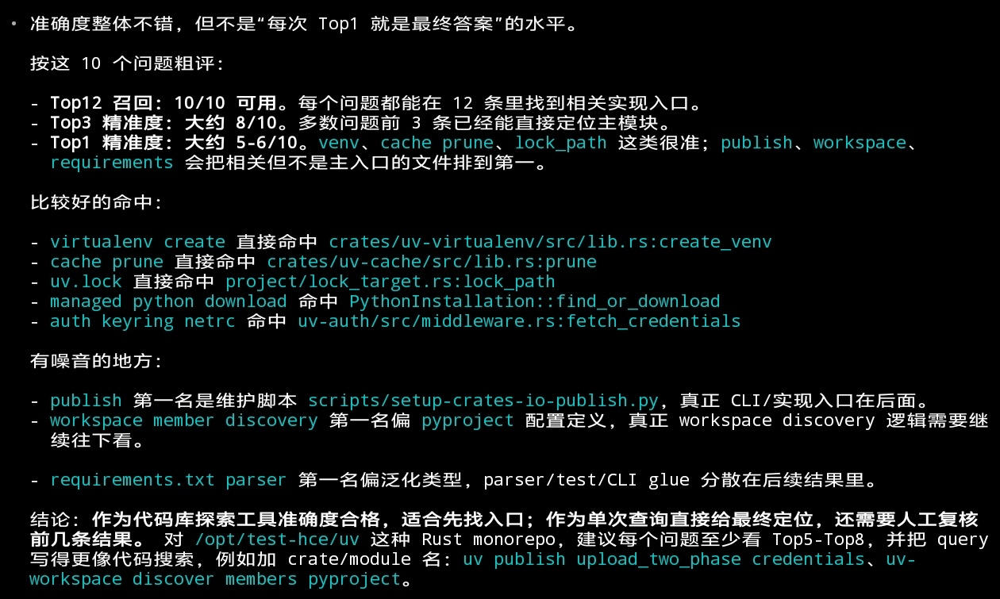
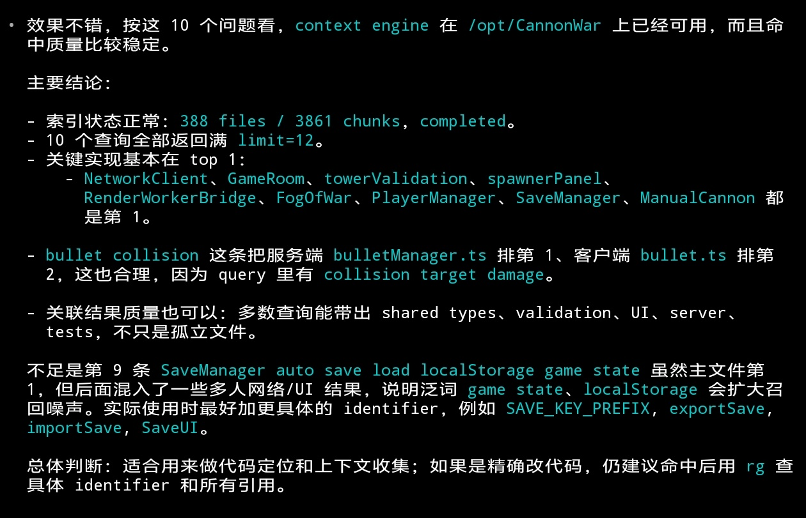
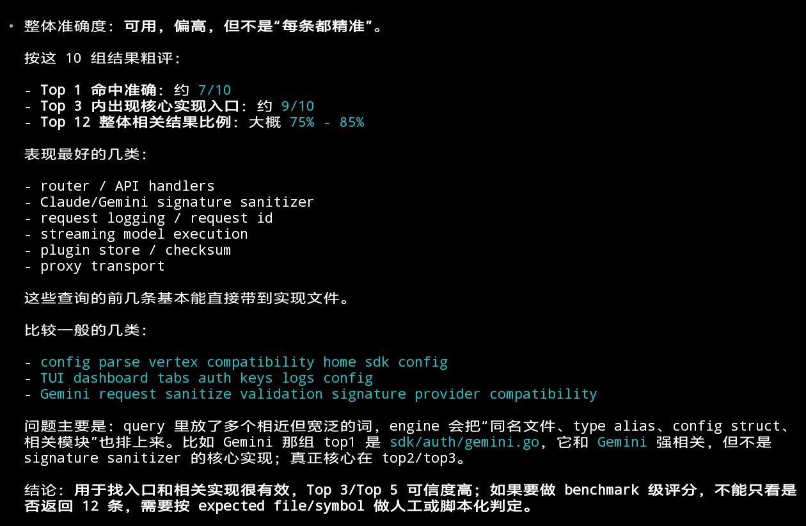

# Hitmux Context Engine

Language: [English](README.md) | 中文 | [Español](README.es.md) | [Français](README.fr.md) | [Deutsch](README.de.md) | [日本語](README.ja.md) | [한국어](README.ko.md)

面向 MCP 客户端的语义代码搜索。

Hitmux Context Engine 会把代码仓库索引到 Milvus 兼容的向量存储中，然后为 Claude Code、OpenAI Codex CLI、OpenCode、Cursor、Windsurf 和其他 MCP 客户端提供聚焦的代码查找工具，可按行为、symbol、workflow 或文件职责搜索代码。

[](https://nodejs.org/)
[](https://www.npmjs.com/package/@hitmux/hitmux-context-engine-core)
[](https://www.npmjs.com/package/@hitmux/hitmux-context-engine-mcp)
[](LICENSE)

当 AI coding agent 需要比文本 grep 更强的能力时，可以使用它：

- 使用自然语言或包含 identifier 的查询搜索已索引代码。
- 优先返回实现文件，同时在有用时呈现相关测试、文档、配置和 exports。
- 使用简单的 `config.conf` 保存项目配置，避免在每个客户端重复配置环境变量。

典型首次使用流程：

```text
hce index .
Check the indexing status
Find the handler that validates MCP tool arguments
```

## Quick Start

创建或补全运行时配置：

```bash
npm install -g @hitmux/hce@latest
hce init
```

然后编辑 `~/.hitmux-context-engine/config.conf` 并填入 provider key。检查本地配置和连通性：

```bash
hce doctor
```

Claude Code 添加 MCP server：

```bash
claude mcp add hitmux-context-engine -- hce
```

OpenAI Codex CLI 添加 MCP server：

```bash
codex mcp add hitmux-context-engine -- hce
```

完整 package alias `@hitmux/hitmux-context-engine` 和原始 MCP package `@hitmux/hitmux-context-engine-mcp` 启动的是同一个 server。

数据库说明：Local Milvus 使用 `milvusAddress = localhost:19530`。self-hosted remote Milvus 把它替换为可访问的 host 和 port；只有服务端要求认证时才添加 `milvusToken`。免费 Zilliz Cloud 数据库可在 https://cloud.zilliz.com/signup 注册，然后使用 cloud public endpoint，并把 Personal Key 写入 `milvusToken`。不能通过 `config.conf` 选择其他数据库 backend。

新仓库需要先在仓库根目录创建首次索引，再依赖 MCP search：

```bash
hce index .
```

然后在仓库中打开 MCP client 并提问：

```text
Check the indexing status
Find functions that handle user authentication
```

也可以在 shell 中检查状态：

```bash
hce status .
```

更多客户端示例，包括 Cursor、Windsurf、Claude Desktop、Gemini CLI、Qwen Code、VS Code MCP、Cline 和 Roo Code，见 [docs/quick-start.zh-CN.md](docs/quick-start.zh-CN.md)。

本地源码 checkout 可运行 `./scripts/install-local-global.sh`，它会构建 workspace，并从当前 checkout 安装用户级 `hitmux-context-engine-mcp` 命令。使用 `sudo` 运行该脚本会全局安装命令。已发布 package 的 Claude Code 和 Codex CLI 设置使用上面展示的全局 `hce` 命令。

## Configuration

Hitmux Context Engine 从 conf 文件读取产品配置：

1. `~/.hitmux-context-engine/config.conf`
2. `./.hitmux-context-engine/config.conf`
3. built-in defaults

项目配置会覆盖全局配置中已出现的字段。环境变量和 `~/.hitmux-context-engine/.env` 不用于 MCP 产品选项。

provider、Milvus/Zilliz、indexing、sync 和 file filtering 选项见 [docs/configuration.zh-CN.md](docs/configuration.zh-CN.md)。

## Packages

- `@hitmux/hitmux-context-engine-mcp`: 面向 Claude Code 和其他 MCP 客户端的 MCP stdio server。
- `@hitmux/hce` 和 `@hitmux/hitmux-context-engine`: MCP server 的 npm package aliases。
- `@hitmux/hitmux-context-engine-core`: TypeScript indexing、splitting、embedding、synchronization 和 vector database package。

工具、package 使用方式和 core API 示例见 [docs/package-reference.zh-CN.md](docs/package-reference.zh-CN.md)。

## Repository Layout

```text
packages/core     Core indexing engine
packages/mcp      MCP server
docs              Flat documentation
examples          Local usage examples
evaluation        Evaluation scripts and raw case-study data
python            Python bridge helpers
```

## Development

使用 Node `>=20` 和 pnpm `>=10`。

```bash
pnpm install
pnpm build
pnpm typecheck
pnpm lint
pnpm --filter @hitmux/hitmux-context-engine-core test
pnpm --filter @hitmux/hitmux-context-engine-mcp test
```

Package-specific commands:

```bash
pnpm build:core
pnpm build:mcp
pnpm build:examples
pnpm dev
pnpm example:basic
```

打开 PR 前，说明修改的 package、行为、验证命令，以及相关配置或迁移说明。

## Documentation

- [docs/configuration.zh-CN.md](docs/configuration.zh-CN.md): canonical conf 配置参考。
- [docs/quick-start.zh-CN.md](docs/quick-start.zh-CN.md): MCP client setup。
- [docs/troubleshooting.zh-CN.md](docs/troubleshooting.zh-CN.md): 常见 setup 和 runtime 问题。
- [docs/package-reference.zh-CN.md](docs/package-reference.zh-CN.md): MCP tools 和 core package 使用方式。

英文文档入口见 [README.md](README.md) 和 [docs/README.md](docs/README.md)。

## License

MIT. See [LICENSE](LICENSE).

## Acknowledgements

本项目基于 [zilliztech/claude-context](https://github.com/zilliztech/claude-context) 的 core。感谢 [Linux Do community](https://linux.do) 的支持。

## 效果展示






